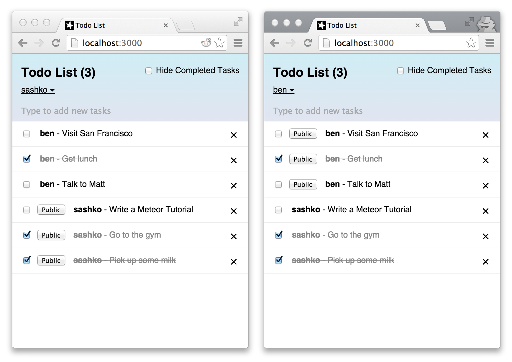

# Meteor Quizes

A multi-user quiz app built with [Meteor](https://www.meteor.com/) and React.



## Features

- User authentication (username/password)
- Real-time quiz answers via Meteor's reactive data layer
- Leaderboard showing scores across all participants

## Prerequisites

- [Meteor](https://www.meteor.com/install) 1.x

## Getting Started

```bash
git clone https://github.com/nadimtuhin/meteor-quizes.git
cd meteor-quizes
meteor
```

App runs at `http://localhost:3000`.

## Stack

- **Meteor** 1.1.0.2
- **React** (via `react` Meteor package)
- **ImmutableJS** (via `dataflows:immutable`)
- **Bootstrap** (via `twbs:bootstrap`)
- **Accounts UI** (username/password)

## Contributing

See [CONTRIBUTING.md](CONTRIBUTING.md).

## License

[MIT](LICENSE) © 2024 nadimtuhin
